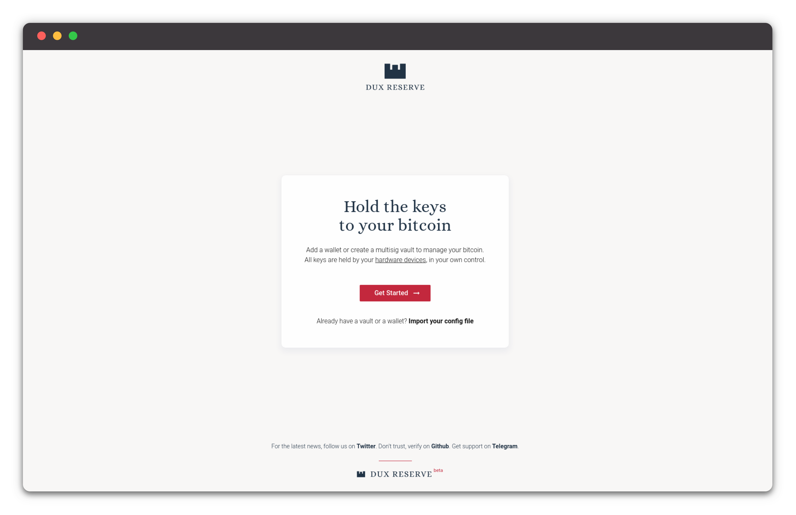
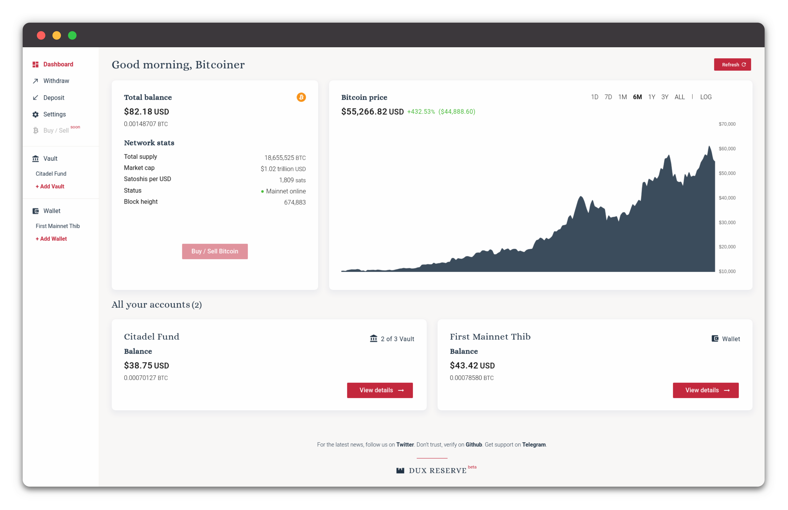

<p align="center">
  
</p>
<h3 align="center">
  Key Manager — 0.4.0-beta
</h3>

----

### Create wallets and multisig vaults. Have full control of your hardware devices. Easy and secure. Free and open-source. All your bitcoin in one place.

----
## Installation MacOS & Windows
1. Download
2. Install
3. Enjoy :) !


## Installation Linux

1. Follow the instruction inside [udev/README.md](udev/README.md) and download the deb file or the AppImage file<sup>[1](#footnote-1)</sup>

2. Install dependencies

  ```
   # DEBIAN/UBUNTU
   sudo apt-get install libusb-1.0-0-dev libudev-dev
  ```


3. In order to enable communication with your Hardware Wallet, we need to provide udev rules for the Linux Kernel.<sup>[2](#footnote-2)</sup>

   ​	a: Grant execution permission to `add_udev_rules.sh`

   ```
   chmod u+x add_udev_rules.sh
   ```

   ​	b: Run `add_udev_rules.sh` script

   ```
   ./add_udev_rules.sh
   ```

4. Install the deb file or run the [AppImage](https://discourse.appimage.org/t/how-to-run-an-appimage/80)

5. Enjoy :) !

<a name="footnote-1">1</a>: DEB is compatible with every debian-like distributions. The AppImage is compatible with most Linux distributions. We will add more installation packages soon (example: RPM)

<a name="footnote-2">2</a>: If you want more details, there's another [readme.md](udev/README.md) inside the `udev` folder


----


## Feedback

Email: [feedback@duxreserve.com](mailto:feedback@duxreserve.com?subject=Beta%20Feedback)

Twitter: [@DuxReserve](https://twitter.com/DuxReserve)

Telegram: [DuxReserve](https://t.me/DuxReserve)

Website: [duxreserve.com](https://duxreserve.com)


----


## Testnet Faucets
A Bitcoin testnet faucet is a website that offers you very small amounts of testnet Bitcoin in exchange for you solving captchas.

  - https://coinfaucet.eu/en/btc-testnet/
  - https://testnet-faucet.mempool.co/
  - https://bitcoinfaucet.uo1.net/
  - https://testnet.help/en/btcfaucet/testnet#claiming


----


## Development
Go to: [DEV-README.md](DEV-README.md)


----


<p align="center">
  
</p>


<p align="center">
  
</p>